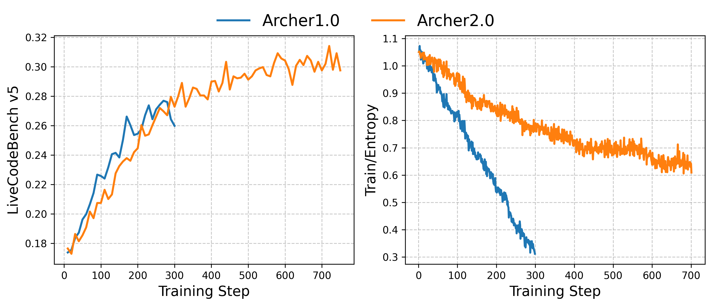

  


<div align="center">

# ✨ Archer2.0

<div>
🏹️  Reinforcement Learning for Enhanced Reasoning in LLMs  🎯
</div>

</div>
<div>
<br>

<div align="center">

[](https://rogue-canopy-54a.notion.site/ASPO-Asymmetric-Importance-Sampling-Policy-Optimization-2650e4c8c16a8034a5d3dfec358c9021)
[](https://arxiv.org/abs/2510.06062)
[](https://github.com/wizard-III/Archer2.0)
[](https://huggingface.co/Fate-Zero/Archer2.0-Code-1.5B-Preview)
[](https://huggingface.co/datasets/Fate-Zero/Archer2.0-Code-1.5B)
[](https://zhuanlan.zhihu.com/p/1950989602023244983)

</div>

## Overview

**Archer2.0** marks a significant evolution from its predecessor through the introduction of **Asymmetric Importance Sampling Policy Optimization (ASPO)**, which is designed to overcome the fundamental limitations of **PPO-Clip**, effectively mitigating issues like **entropy collapse** and **repetitive outputs**, preventing **premature convergence**, and thereby enabling more advanced **reinforcement learning** capabilities.

<div align="center">

</div>
<br>

While our mathematical models are still in training and have not converged, we have evaluated Archer2.0 on the LiveCodeBench v5 and v6 code benchmarks. The results are detailed in the table below.

<table>
  <thead>
    <tr>
      <th rowspan="2">Method</th>
      <th colspan="2">LCB v5 (2024.08.01–2025.02.01)</th>
      <th colspan="2">LCB v6 (2025.02.01–2025.05.01)</th>
      <th rowspan="2">Avg.</th>
    </tr>
    <tr>
      <th>avg@8</th>
      <th>pass@8</th>
      <th>avg@16</th>
      <th>pass@16</th>
    </tr>
  </thead>
  <tbody>
    <tr>
      <td>DeepSeek-R1-1.5B</td>
      <td>16.7</td>
      <td>29.0</td>
      <td>17.2</td>
      <td>34.4</td>
      <td>17.0</td>
    </tr>
    <tr>
      <td>DAPO</td>
      <td>26.0</td>
      <td>40.5</td>
      <td>27.6</td>
      <td>43.5</td>
      <td>26.8</td>
    </tr>
    <tr>
      <td>DeepCoder-1.5B</td>
      <td>23.3</td>
      <td>39.1</td>
      <td>22.6</td>
      <td>42.0</td>
      <td>23.0</td>
    </tr>
    <tr>
      <td>Nemotron-1.5B</td>
      <td>26.1</td>
      <td>35.5</td>
      <td>29.5</td>
      <td>42.8</td>
      <td>27.8</td>
    </tr>
    <tr>
      <td><strong>Archer-Code-1.5B</strong></td>
      <td><strong>29.4</strong></td>
      <td><strong>43.7</strong></td>
      <td><strong>30.2</strong></td>
      <td><strong>45.8</strong></td>
      <td><strong>29.8</strong></td>
    </tr>
    <tr>
      <td><strong>Archer2.0-Code-1.5B-Preview</strong></td>
      <td><strong>31.5</strong></td>
      <td><strong>47.0</strong></td>
      <td><strong>30.5</strong></td>
      <td><strong>46.0</strong></td>
      <td><strong>31.0</strong></td>
    </tr>
  </tbody>
</table>


## Getting Started

### Datasets

```
python tools/download_data.py

wget -O data/test/livecodebench_v5.json \
  https://huggingface.co/datasets/Fate-Zero/ArcherCodeR-Dataset/resolve/main/test/livecodebench_v5.json
```

### 1 Installation

```bash
# Installing Python 3.10 Environment.
conda create -n archer python=3.10 -y
conda activate archer

# Installing dependencies.
pip install torch==2.5.1 --index-url https://download.pytorch.org/whl/cu124
wget -nv https://github.com/Dao-AILab/flash-attention/releases/download/v2.7.3/flash_attn-2.7.3+cu12torch2.5cxx11abiFALSE-cp310-cp310-linux_x86_64.whl
pip install --no-cache-dir flash_attn-2.7.3+cu12torch2.5cxx11abiFALSE-cp310-cp310-linux_x86_64.whl

cd Archer2.0
pip install -e .

# change nano ~/.conda/envs/archer/lib/python3.10/site-packages/peft/tuners/lora/model.py to import directly from transformers
pip install -u transformers
```

#### Initialize Ray Cluster

We have provided a one-click script to initialize Ray environments on any number of machines. Run the following command on the head node:

```bash
bash ./tools/start_ray.sh
```

Note: 
- Please replace your_wandb_api_key in export WANDB_API_KEY=your_wandb_api_key with your actual key.
- Hostfile locations vary across operating systems (e.g., on my machine, it's located at /etc/mpi/hostfile). Locate the file on your server and modify its content accordingly.

### 2 Training

We have currently provided the script and data to reproduce the results of the “Archer2.0-Code-1.5B-Preview”.

```bash
bash ./scripts/train/run_archer2.0_qwen2.5_1.5b_code.sh

# if you get errors related to this:
unset ROCR_VISIBLE_DEVICES
unset HIP_VISIBLE_DEVICES

```

### 3 Evaluation

When using the Verl framework for RL training, we observed a consistent discrepancy between the evaluation results produced by the in-training weights and the saved model checkpoints. To ensure the accurate selection of model checkpoints, our evaluation is conducted using the saved checkpoints.

#### 3.1 Automated Evaluation Pipeline
To automatically scan a specified directory and evaluate all saved model checkpoints during training, run the following script on a GPU-enabled machine:

```bash
bash ./tools/run_eval_pipeline.sh
```
Since code evaluation tasks run on CPU only, we separate the LiveCodeBench evaluation to optimize GPU utilization. Execute the following script on a CPU machine to automatically evaluate the inference results generated in the previous step:

```bash
bash ./tools/run_lcb_eval.sh
```

#### 3.2 Head-On Evaluation

##### Step 1: Convert Model Format

Run the following command to convert the model to Hugging Face format:

```bash
bash ./tools/model_merge.sh
```

##### Step 2: Run Inference

Execute the script below to generate inference results for the test data:

```bash
bash ./scripts/eval/run_eval.sh
```

##### Step 3: Run Evaluation

Navigate to line 245 in [LiveCodeBench/blob/main/lcb_runner/evaluation/compute_code_generation_metrics_v5.py](https://github.com/wizard-III/LiveCodeBench/blob/main/lcb_runner/evaluation/compute_code_generation_metrics_v5.py#L245) and update the parquet_file path to point to the result file generated in Step 2. 

Execute the following script to evaluate performance on the LiveCodeBench v5 benchmark:

```bash
python LiveCodeBench/lcb_runner/evaluation/compute_code_generation_metrics_v5.py
```

Note: Please update the path parameters in the scripts above as needed.

## Technical Report
[ASPO: Asymmetric Importance Sampling Policy Optimization](https://arxiv.org/abs/2510.06062)

## Acknowledgements

- We build our model upon [`DeepSeek-R1-Distill-Qwen-1.5B`](https://huggingface.co/deepseek-ai/DeepSeek-R1-Distill-Qwen-1.5B).
- Training was carried out with a modified version of [verl](https://github.com/volcengine/verl).

## Citation

Please cite the following:
```bibtex
@article{wang2025aspo,
  title={Aspo: Asymmetric importance sampling policy optimization},
  author={Wang, Jiakang and Liu, Runze and Lin, Lei and Hu, Wenping and Li, Xiu and Zhang, Fuzheng and Zhou, Guorui and Gai, Kun},
  journal={arXiv preprint arXiv:2510.06062},
  year={2025}
}
```

```bibtex
@article{wang2025stabilizing,
  title={Stabilizing Knowledge, Promoting Reasoning: Dual-Token Constraints for RLVR},
  author={Wang, Jiakang and Liu, Runze and Zhang, Fuzheng and Li, Xiu and Zhou, Guorui},
  journal={arXiv preprint arXiv:2507.15778},
  year={2025}
}
```

