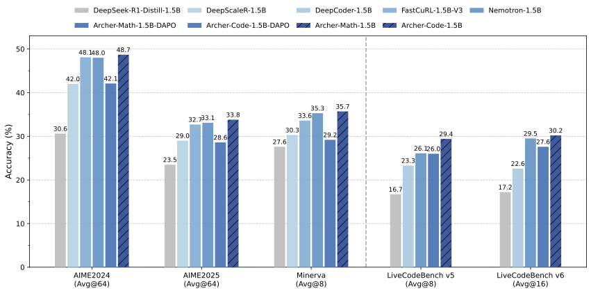

  


<div align="center">

# ✨ Archer2.0

<div>
🏹️  Reinforcement Learning for Enhanced Reasoning in LLMs  🎯
</div>

</div>
<div>
<br>

<div align="center">

[](https://rogue-canopy-54a.notion.site/Asymmetric-Dual-Clipping-Policy-Optimization-Escaping-Local-Optima-Unlocking-the-Full-Potential--2650e4c8c16a8034a5d3dfec358c9021)
[](https://github.com/wizard-III/Archer2.0)
[](https://huggingface.co/Fate-Zero/Archer2.0-Code-1.5B-Preview)
[](https://huggingface.co/datasets/Fate-Zero/Archer2.0-Code-1.5B)
[](https://zhuanlan.zhihu.com/p/1950989602023244983)

</div>

## Overview

The Archer series focuses on research into RL algorithms and training for medium and small-scale models, aiming to deepen the community's understanding of the fundamental principles of reinforcement learning (RL) on large language models (LLMs). All released content will be comprehensively open-sourced to advance community research development.

<!-- <div align="center">


<sub>Archer significantly improves the reasoning performance upon DAPO and outperforms previous 1.5B-level SOTA reasoning models.</sub>
</div> -->

**Archer** is an open-source initiative enhancing reasoning in large language models through scalable, rule-governed reinforcement learning. We provide full-stack reproducibility including:

- Training code and pipelines
- Curated datasets
- Trained models
- Complete training logs

**Current Models**:
- **[Archer2.0-Code-1.5B-Preview](https://huggingface.co/Fate-Zero/Archer2.0-Code-1.5B-Preview)** - SOTA among similarly-sized models.

## Evaluation
We conduct evaluation on both mathematical and coding benchmarks. Due to the high variance of the outputs from reasoning models, we report avg@K (pass@1 performance averaged over K outputs) and pass@K for each benchmark. The detailed results are shown in the table below.

<table>
  <thead>
    <tr>
      <th rowspan="2">Method</th>
      <th colspan="2">LCB v5 (2024.08.01–2025.02.01)</th>
      <th colspan="2">LCB v6 (2025.02.01–2025.05.01)</th>
      <th rowspan="2">Avg.</th>
    </tr>
    <tr>
      <th>avg@8</th>
      <th>pass@8</th>
      <th>avg@16</th>
      <th>pass@16</th>
    </tr>
  </thead>
  <tbody>
    <tr>
      <td>DeepSeek-R1-1.5B</td>
      <td>16.7</td>
      <td>29.0</td>
      <td>17.2</td>
      <td>34.4</td>
      <td>17.0</td>
    </tr>
    <tr>
      <td>DAPO</td>
      <td>26.0</td>
      <td>40.5</td>
      <td>27.6</td>
      <td>43.5</td>
      <td>26.8</td>
    </tr>
    <tr>
      <td>DeepCoder-1.5B</td>
      <td>23.3</td>
      <td>39.1</td>
      <td>22.6</td>
      <td>42.0</td>
      <td>23.0</td>
    </tr>
    <tr>
      <td>Nemotron-1.5B</td>
      <td>26.1</td>
      <td>35.5</td>
      <td>29.5</td>
      <td>42.8</td>
      <td>27.8</td>
    </tr>
    <tr>
      <td><strong>Archer-Code-1.5B</strong></td>
      <td><strong>29.4</strong></td>
      <td><strong>43.7</strong></td>
      <td><strong>30.2</strong></td>
      <td><strong>45.8</strong></td>
      <td><strong>29.8</strong></td>
    </tr>
    <tr>
      <td><strong>Archer2.0-Code-1.5B-Preview</strong></td>
      <td><strong>31.5</strong></td>
      <td><strong>47.0</strong></td>
      <td><strong>30.5</strong></td>
      <td><strong>46.0</strong></td>
      <td><strong>31.0</strong></td>
    </tr>
  </tbody>
</table>


## Getting Started

### Installation

```bash
# Installing Python 3.10 Environment.
conda create -n archer python=3.10 -y
conda activate archer

# Installing dependencies.
pip install torch==2.5.1 --index-url https://download.pytorch.org/whl/cu124
wget -nv https://github.com/Dao-AILab/flash-attention/releases/download/v2.7.3/flash_attn-2.7.3+cu12torch2.5cxx11abiFALSE-cp310-cp310-linux_x86_64.whl
pip install --no-cache-dir flash_attn-2.7.3+cu12torch2.5cxx11abiFALSE-cp310-cp310-linux_x86_64.whl

cd ArcherCodeR
pip install -e .
```

#### Initialize Ray Cluster

We have provided a one-click script to initialize Ray environments on any number of machines. Run the following command on the head node:

```bash
bash ./tools/start_ray.sh
```

Note: 
- Please replace your_wandb_api_key in export WANDB_API_KEY=your_wandb_api_key with your actual key.
- Hostfile locations vary across operating systems (e.g., on my machine, it's located at /etc/mpi/hostfile). Locate the file on your server and modify its content accordingly.

### Training

We have currently only provided the script and data to reproduce the results of the “Archer-Code-1.5B”.

```bash
bash ./scripts/train/run_archer_qwen2.5_1.5b_code.sh
```

### Evaluation

#### Auto Eval Pipeline

```bash
bash ./tools/run_eval_pipeline.sh
```

```bash
bash ./tools/run_lcb_eval.sh
```


#### Head-On Eval

##### Step 1: Convert model format

Run the following command to convert the model to Hugging Face format:

```bash
bash ./tools/model_merge.sh
```

##### Step 2: Run evaluation

Execute the script below to evaluate model performance on the LiveCodeBench v5 benchmark:

```bash
bash ./scripts/eval/run_eval.sh
```

Note: Please update the path parameters in the scripts above as needed.

## Technical Report
[ASPO: Asymmetric Importance Sampling Policy Optimization](https://rogue-canopy-54a.notion.site/ASPO-Asymmetric-Importance-Sampling-Policy-Optimization-2650e4c8c16a8034a5d3dfec358c9021)
[Stabilizing Knowledge, Promoting Reasoning: Dual-Token Constraints for RLVR](https://arxiv.org/abs/2507.15778)

## Acknowledgements

- We build our model upon [`DeepSeek-R1-Distill-Qwen-1.5B`](https://huggingface.co/deepseek-ai/DeepSeek-R1-Distill-Qwen-1.5B).
- Training was carried out with a modified version of [verl](https://github.com/volcengine/verl).

## Citation

Please cite the following:
```bibtex
@misc{ASPO2025,
  title={ASPO: Asymmetric Importance Sampling Policy Optimization},
  author={Wang, Jiakang and Liu, Runze and Lin, Lei and Hu, Wenping and Li, Xiu and Zhang, Fuzheng and Zhou, Guorui and Gai, Kun},
  howpublished={\url{https://rogue-canopy-54a.notion.site/ASPO-Asymmetric-Importance-Sampling-Policy-Optimization-2650e4c8c16a8034a5d3dfec358c9021}},
  note={Notion Blog},
  year={2025}
}
```

```bibtex
@article{wang2025stabilizing,
  title={Stabilizing Knowledge, Promoting Reasoning: Dual-Token Constraints for RLVR},
  author={Wang, Jiakang and Liu, Runze and Zhang, Fuzheng and Li, Xiu and Zhou, Guorui},
  journal={arXiv preprint arXiv:2507.15778},
  year={2025}
}
```

